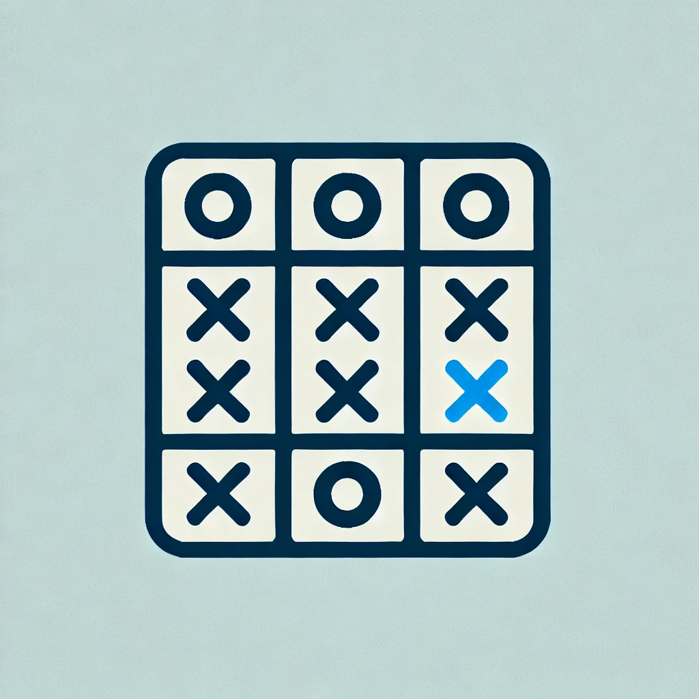

# 🎯 Tic-Tac-Toe Game

<p align="center">
  
</p>

> 🎯 *Logo generated using AI*  


🚀 A modern and fun Tic-Tac-Toe game built using **Java** and **Android Studio** with a sleek UI and smooth gameplay experience!


---

## 🎮 **Game Features**  
✅ Simple and clean interface  
✅ Smooth animations and transitions  
✅ Reset option to restart the game instantly  
✅ Modern gradient background  
✅ Smart winner detection logic  
✅ Works on all screen sizes  

---

## 🛠️ **Tech Stack**  
| Technology | Description |
|-----------|-------------|
| **Java** | Game logic and UI handling |
| **Android Studio** | Development environment |
| **Material Design** | Styling and components |
| **Gradle** | Build automation tool |

---

## 🎨 **UI Highlights**  
- 🌈 **Gradient Background:** Stylish green gradient background  
- ❌ **X and O Styling:** Clean and minimalist button design  
- 🔥 **Smooth Animations:** Fast and responsive gameplay  
- 🏆 **Winner Announcement:** Displays a toast with the winner  

---

## 🚀 **How to Play**  
1. Open the app  
2. Players take turns placing `X` and `O`  
3. First player to get 3 in a row (horizontally, vertically, or diagonally) wins  
4. If all cells are filled without a winner, the game is drawn  
5. Tap **Restart** to play again  

---

## 🏆 **Winning Conditions**  
- Three matching symbols in any row  
- Three matching symbols in any column  
- Three matching symbols diagonally  

---

## 🛠️ **Installation**  
1. Clone the repository:  
```bash
git clone https://github.com/Vishwathma2004/Tic-Tac-Toe-App.git
```
2. Open in Android Studio  
3. Build and run the project  

---

## 🚧 **Future Enhancements**  
- 🌍 Multiplayer over the internet  
- 🎯 AI opponent  
- 🏅 Leaderboard integration  


---
## 📩 **Contact**  
📧 Email: vishwathman@gmail.com  
💼 [LinkedIn](https://linkedin.com/in/vishwathma2004)  

---

## 🌟 **If you like this project, please give it a star!** ⭐

---

<div align="center">

🎮 Made with ❤️ for Tic-Tac-Toe Lovers!

</div>
